# Distributed Cache — Low Level Design

Complete architecture document for the Distributed Cache system.  
Every class, interface, enum, and inner class in the codebase is mapped below with exact fields, methods, design patterns used, layer ownership, and relationship linkages.

---

## Layer Architecture

| Layer | Concern | Classes |
|-------|---------|---------|
| **Client / Entry** | System bootstrap, user-facing API | `DistributedCache`, `CacheConfig`, `CacheProxyConfig` |
| **Load Balancing** | Traffic distribution across proxy instances | `LoadBalancer` |
| **Proxy** | Request interception, routing delegation | `CacheProxy` |
| **Routing** | Key → Node mapping via hashing | `CacheRouter`, `HashingStrategy`, `SimpleHashStrategy` |
| **Cluster** | Logical grouping of cache servers | `CacheCluster` |
| **Node** | Single cache server abstraction | `CacheNode` |
| **Core Logic** | In-memory storage + eviction + DB fallback | `CacheStore`, `CacheService` |
| **Eviction** | Strategy pattern — pluggable eviction policies | `EvictionStrategy`, `LRUEvictionPolicy` |
| **Data Structure** | LRU ordering via doubly linked list | `DoubleLinkedList`, `Node` |
| **Database / Persistence** | Fallback DB layer (simulated MongoDB) | `DbService`, `DbConnectionPool`, `SimulatedConnection` |
| **Adapter** | Adapter pattern — DB vendor abstraction | `DatabaseAdapter`, `MongoAdapter`, `PostgresAdapter` |
| **Repository** | Simulated database store | `MongoDbRepository` |
| **DTO** | Request/Response data transfer objects | `RequestDTO`, `ResponseDTO` |

---

## UML Class Diagram

```mermaid
classDiagram

    %% ─────────────────────────────────────────────
    %% CLIENT / ENTRY LAYER
    %% ─────────────────────────────────────────────
    class DistributedCache {
        -config : CacheConfig
        -cacheStore : CacheStore
        +DistributedCache(config)
        +put(key, value) void
        +get(key) ResponseDTO
        +clear() void
        +getConfig() CacheConfig
    }

    class CacheConfig {
        -numNode : int
        -capacityPerNode : int
        -evictionStrategy : EvictionStrategy
        +CacheConfig(numNode, capacityPerNode, evictionStrategy)
        +getNumNode() int
        +getCapacityPerNode() int
        +getEvictionStrategy() EvictionStrategy
    }

    class CacheProxyConfig {
        -noOfProxies : int
        +getProxyCount() int
    }

    %% ─────────────────────────────────────────────
    %% LOAD BALANCING LAYER
    %% ─────────────────────────────────────────────
    class LoadBalancer {
        <<singleton>>
        -counter : AtomicInteger
        -instance$ : LoadBalancer
        -proxyCount : int
        -proxies : List~CacheProxy~
        -LoadBalancer(cluster, hashingStrategy)
        +getInstance$(cluster, hashingStrategy) LoadBalancer
        +routeRequest() CacheProxy
    }

    %% ─────────────────────────────────────────────
    %% PROXY LAYER
    %% ─────────────────────────────────────────────
    class CacheProxy {
        -router : CacheRouter
        +CacheProxy(cluster, hashingStrategy)
        +get(request) ResponseDTO
        +put(request) void
    }

    %% ─────────────────────────────────────────────
    %% ROUTING LAYER
    %% ─────────────────────────────────────────────
    class CacheRouter {
        <<singleton>>
        -router$ : CacheRouter
        -hashingStrategy : HashingStrategy
        -config : CacheConfig
        -cacheServers : List~CacheNode~
        -CacheRouter(cluster, hashingStrategy)
        +getRouter$(cluster, hashingStrategy) CacheRouter
        +routeRequest(request) CacheNode
    }

    class HashingStrategy {
        <<interface>>
        +hash(key, config) int
    }

    class SimpleHashStrategy {
        +hash(key, config) int
    }

    %% ─────────────────────────────────────────────
    %% CLUSTER LAYER
    %% ─────────────────────────────────────────────
    class CacheCluster {
        -cacheServers : List~CacheNode~
        +CacheCluster(config, evictionStrategy, dbService)
        +getCacheNodes() List~CacheNode~
    }

    %% ─────────────────────────────────────────────
    %% CACHE NODE LAYER
    %% ─────────────────────────────────────────────
    class CacheNode {
        -cacheStore : CacheStore
        +CacheNode(config, evictionStrategy, dbService)
        +get(request) ResponseDTO
        +set(request) void
    }

    %% ─────────────────────────────────────────────
    %% CORE LOGIC LAYER
    %% ─────────────────────────────────────────────
    class CacheStore {
        -capacity : int
        -house : Map~String, Node~
        -evictionStrategy : EvictionStrategy
        -dbService : DbService
        -cacheService : CacheService
        +CacheStore(capacity, evictionStrategy, dbService)
        +get(request) ResponseDTO
        +put(request) void
        +clear() void
    }

    class CacheService {
        -house : Map~String, Node~
        -capacity : int
        -evictionStrategy : EvictionStrategy
        -dbService : DbService
        +CacheService(house, capacity, evictionStrategy, dbService)
        +get(request) ResponseDTO
        +put(request) void
        -remove() Node
        +clear() void
    }

    %% ─────────────────────────────────────────────
    %% EVICTION LAYER (Strategy Pattern)
    %% ─────────────────────────────────────────────
    class EvictionStrategy {
        <<interface>>
        +onAccess(node) void
        +onInsert(node) void
        +evict() Node
        +clear() void
    }

    class LRUEvictionPolicy {
        -dll : DoubleLinkedList
        +LRUEvictionPolicy()
        +onAccess(node) void
        +onInsert(node) void
        +evict() Node
        +clear() void
    }

    %% ─────────────────────────────────────────────
    %% DATA STRUCTURE LAYER
    %% ─────────────────────────────────────────────
    class DoubleLinkedList {
        -head : Node
        -tail : Node
        +DoubleLinkedList()
        +addToHead(node) void
        +evict() Node
        +clear() void
    }

    class Node {
        -key : String
        -value : String
        #prev : Node
        #next : Node
        +Node(key, value)
        +getKey() String
        +getValue() String
    }

    %% ─────────────────────────────────────────────
    %% DTO LAYER
    %% ─────────────────────────────────────────────
    class RequestDTO {
        -key : String
        -value : String
        -operation : String
        +RequestDTO(key, value, operation)
        +getKey() String
        +getValue() String
        +getOperation() String
    }

    class ResponseDTO {
        -key : String
        -value : String
        +ResponseDTO(key, value)
        +getKey() String
        +getValue() String
    }

    %% ─────────────────────────────────────────────
    %% DATABASE SERVICE LAYER
    %% ─────────────────────────────────────────────
    class DbService {
        <<singleton>>
        -instance$ : DbService
        -pool : DbConnectionPool
        -DbService(dbAdapter)
        +getInstance$() DbService
        +executeQuery(key) String
    }

    class DbConnectionPool {
        <<enumeration / singleton>>
        INSTANCE
        -dbAdapter : DatabaseAdapter
        -availableConnections : List~SimulatedConnection~
        -busyConnections : List~SimulatedConnection~
        -MAX_POOL_SIZE : int
        +init(dbAdapter, poolSize) DbConnectionPool
        -initializePool() void
        +getConnection() SimulatedConnection
        +releaseConnection(conn) void
    }

    class SimulatedConnection {
        <<inner class>>
        -url : String
        -username : String
        -password : String
        -closed : boolean
        +SimulatedConnection(adapter)
        +executeQuery(key) String
        +close() void
        +getUrl() String
        +getUsername() String
        +isClosed() boolean
    }

    %% ─────────────────────────────────────────────
    %% ADAPTER LAYER (Adapter Pattern)
    %% ─────────────────────────────────────────────
    class DatabaseAdapter {
        <<interface>>
        +getUrl() String
        +getUsername() String
        +getPassword() String
        +executeQuery(key) String
    }

    class MongoAdapter {
        +getUrl() String
        +getUsername() String
        +getPassword() String
        +executeQuery(key) String
    }

    class PostgresAdapter {
        <<stub>>
    }

    %% ─────────────────────────────────────────────
    %% REPOSITORY LAYER
    %% ─────────────────────────────────────────────
    class MongoDbRepository {
        <<enumeration / singleton>>
        INSTANCE
        -database : Map~String, String~
        -URL : String
        -username : String
        -password : String
        +getValue(key) String
        +setValue(key, value) void
        +getURL() String
        +getUsername() String
        +getPassword() String
    }

    %% ═══════════════════════════════════════════════
    %% RELATIONSHIPS
    %% ═══════════════════════════════════════════════

    %% Entry → Core
    DistributedCache --> CacheConfig : configured by
    DistributedCache --> CacheStore : owns

    %% Load Balancing
    LoadBalancer --> CacheProxy : round-robin routes to
    LoadBalancer --> CacheCluster : initialized with
    LoadBalancer --> HashingStrategy : passes to proxies

    %% Proxy → Routing
    CacheProxy --> CacheRouter : delegates routing

    %% Routing
    CacheRouter --> CacheCluster : reads node list from
    CacheRouter --> HashingStrategy : hashes key with
    CacheRouter --> CacheNode : selects target
    SimpleHashStrategy ..|> HashingStrategy : implements

    %% Cluster composition
    CacheCluster *-- CacheNode : contains N nodes

    %% Node → Store
    CacheNode --> CacheStore : owns internally

    %% Core Logic
    CacheStore --> CacheService : delegates all ops
    CacheStore --> EvictionStrategy : injects into service
    CacheStore --> DbService : injects into service
    CacheService --> EvictionStrategy : calls on access/insert/evict
    CacheService --> DbService : fallback on cache miss
    CacheService --> Node : manages via HashMap

    %% Eviction (Strategy Pattern)
    LRUEvictionPolicy ..|> EvictionStrategy : implements
    LRUEvictionPolicy --> DoubleLinkedList : uses for ordering

    %% DLL structure
    DoubleLinkedList *-- Node : maintains chain of

    %% DB Service → Connection Pool
    DbService --> DbConnectionPool : borrows connections from
    DbService --> MongoAdapter : default adapter
    DbConnectionPool *-- SimulatedConnection : manages pool of
    SimulatedConnection --> DatabaseAdapter : reads credentials from

    %% Adapter Pattern
    MongoAdapter ..|> DatabaseAdapter : implements
    MongoAdapter --> MongoDbRepository : delegates to

    %% DTO Usage (not drawn to avoid clutter — used across all layers)
    %% RequestDTO  : CacheProxy, CacheNode, CacheStore, CacheService
    %% ResponseDTO : CacheProxy, CacheNode, CacheStore, CacheService
```



---

## Design Patterns Used

| Pattern | Where | Why |
|---------|-------|-----|
| **Strategy** | `EvictionStrategy` ← `LRUEvictionPolicy` | Pluggable eviction algorithms — swap LRU for LFU/FIFO without touching core logic |
| **Adapter** | `DatabaseAdapter` ← `MongoAdapter` / `PostgresAdapter` | Decouple cache system from DB vendor — switch Mongo → Postgres by swapping adapter |
| **Singleton** | `LoadBalancer`, `CacheRouter`, `DbService` | Single shared instance across all clients — thread-safe double-checked locking |
| **Enum Singleton** | `DbConnectionPool`, `MongoDbRepository` | JVM-guaranteed singletons — inherently serialization-safe and thread-safe |
| **Proxy** | `CacheProxy` | Intercepts client requests, adds routing + fallback logic before hitting actual cache |
| **Object Pool** | `DbConnectionPool` → `SimulatedConnection` | Reuse expensive DB connections instead of creating/destroying per query |

---

## Mental Model — Request Flow

### Path A: Cache Hit
```
Client
  │
  ▼
DistributedCache.get(key)
  │
  ▼
CacheStore.get(request)
  │
  ▼
CacheService.get(request)
  │
  ├─ HashMap lookup → Node found ✅
  ├─ EvictionStrategy.onAccess(node)  ← moves node to DLL head
  │
  ▼
ResponseDTO(key, value)
```

### Path B: Cache Miss → DB Fallback
```
Client
  │
  ▼
DistributedCache.get(key)
  │
  ▼
CacheStore.get(request)
  │
  ▼
CacheService.get(request)
  │
  ├─ HashMap lookup → null ❌ (CACHE MISS)
  ├─ DbService.executeQuery(key)
  │     │
  │     ▼
  │   DbConnectionPool.getConnection()
  │     │
  │     ▼
  │   SimulatedConnection.executeQuery(key)
  │     │
  │     ▼
  │   MongoAdapter.executeQuery(key)
  │     │
  │     ▼
  │   MongoDbRepository.getValue(key)
  │
  ▼
ResponseDTO(key, valueFromDB)
```

### Path C: Cache Write with Eviction
```
Client
  │
  ▼
DistributedCache.put(key, value)
  │
  ▼
CacheStore.put(request)
  │
  ▼
CacheService.put(request)
  │
  ├─ Create Node(key, value)
  ├─ EvictionStrategy.onInsert(node)  ← adds to DLL head
  ├─ if (map.size == capacity)
  │     ├─ EvictionStrategy.evict()   ← removes DLL tail (LRU)
  │     └─ HashMap.remove(lruKey)
  ├─ HashMap.put(key, node)
  │
  ▼
  done
```

### Path D: Multi-Node (Full Distributed Path via LoadBalancer)
```
Client
  │
  ▼
LoadBalancer.routeRequest()           ← round-robin selects proxy
  │
  ▼
CacheProxy.get(request)
  │
  ▼
CacheRouter.routeRequest(request)    ← hashes key → selects node
  │
  ▼
CacheNode.get(request)
  │
  ▼
CacheStore → CacheService            ← same as Path A/B above
```

---

## Concurrency Concerns

| Component | Thread-Safety Status | Mechanism | Known Issue |
|-----------|---------------------|-----------|-------------|
| `LoadBalancer` | ✅ Safe | `AtomicInteger` for round-robin + DCL singleton | — |
| `CacheRouter` | ✅ Safe | `volatile` + DCL singleton | — |
| `DbService` | ✅ Safe | `volatile` + DCL singleton | — |
| `DbConnectionPool` | ✅ Safe | `synchronized` getConnection/releaseConnection + `wait/notifyAll` | — |
| `MongoDbRepository` | ✅ Safe | Enum singleton (JVM guaranteed) | — |
| `CacheStore.house` | ❌ **Not safe** | Plain `HashMap` | Concurrent `put()` causes lost updates, corrupted buckets |
| `CacheService.put()` | ❌ **Not safe** | No synchronization on size check + evict + insert | Race between `size == capacity` check and `evict()` |
| `DoubleLinkedList` | ❌ **Not safe** | No synchronization on pointer manipulation | Concurrent `addToHead()` / `evict()` corrupts node links |
| `LRUEvictionPolicy` | ❌ **Not safe** | Delegates to unsynchronized DLL | Inherits DLL's thread-safety issues |

### Remediation Options
1. **Quick fix**: Wrap `CacheService.get()` and `CacheService.put()` in `synchronized` blocks
2. **Better**: Swap `HashMap` → `ConcurrentHashMap` + synchronize DLL operations separately
3. **Best**: Use `ReadWriteLock` — concurrent reads allowed, exclusive writes on the DLL

---

## File Inventory

| File | Layer | Type | Lines |
|------|-------|------|-------|
| `DistributedCache.java` | Entry | Class (bootstrap + tests) | ~310 |
| `CacheConfig.java` | Entry | Class (configuration) | 30 |
| `CacheProxyConfig.java` | Entry | Class (proxy config) | 10 |
| `LoadBalancer.java` | Load Balancing | Singleton Class | 37 |
| `CacheProxy.java` | Proxy | Class | 23 |
| `CacheRouter.java` | Routing | Singleton Class | 36 |
| `HashingStrategy.java` | Routing | Interface | 9 |
| `SimpleHashStrategy.java` | Routing | Class | 14 |
| `CacheCluster.java` | Cluster | Class | 17 |
| `CacheNode.java` | Node | Class | 20 |
| `CacheStore.java` | Core Logic | Class | 40 |
| `CacheService.java` | Core Logic | Class | 53 |
| `EvictionStrategy.java` | Eviction | Interface | 8 |
| `LRUEvictionPolicy.java` | Eviction | Class | 30 |
| `DoubleLinkedList.java` | Data Structure | Class | 55 |
| `Node.java` | Data Structure | Class | 26 |
| `RequestDTO.java` | DTO | Class | 32 |
| `ResponseDTO.java` | DTO | Class | 21 |
| `DbService.java` | Database | Singleton Class | 44 |
| `DbConnectionPool.java` | Database | Enum Singleton | 93 |
| `DatabaseAdapter.java` | Adapter | Interface | 8 |
| `MongoAdapter.java` | Adapter | Class | 26 |
| `PostgresAdapter.java` | Adapter | Stub Class | 6 |
| `MongoDbRepository.java` | Repository | Enum Singleton | 36 |
