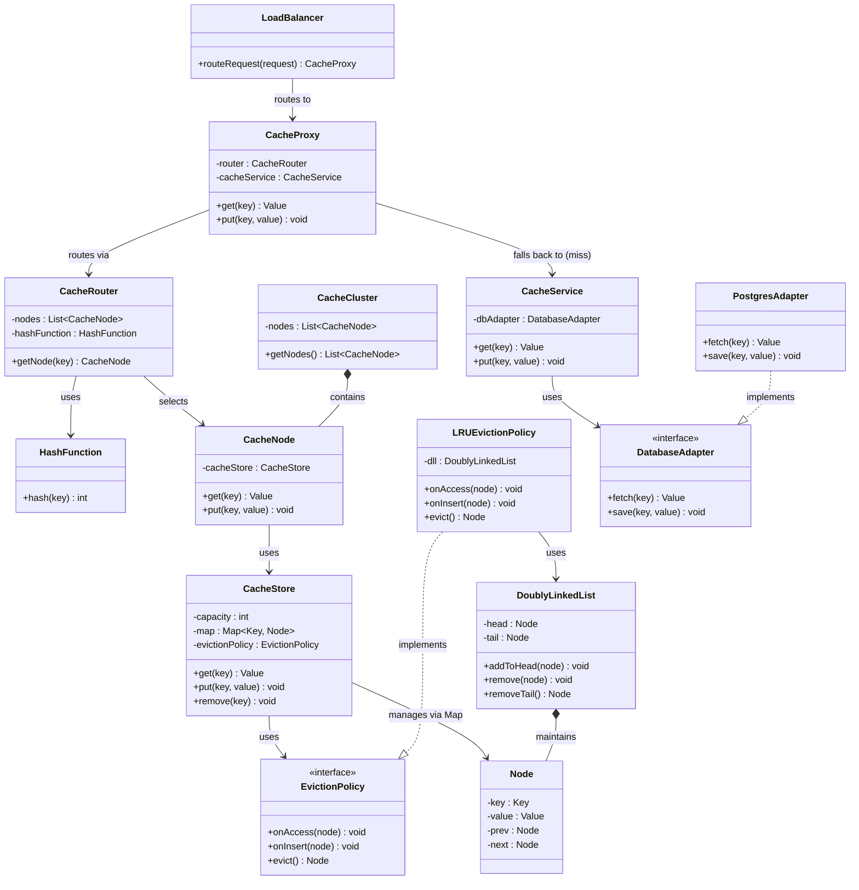

# Distributed Cache - Low Level Design

This document contains the UML class diagram for the Distributed Cache system, structured across various layers such as Entry, Routing, Core Logic, Eviction, and Service layers.

## UML Class Diagram

## Mental Model Flow
**Client Request Path:**
1. **Client** hits **LoadBalancer**
2. **LoadBalancer** routes to **CacheProxy**
3. **CacheProxy** delegates to **CacheRouter** to find the responsible cache node
4. **CacheRouter** identifies the appropriate **CacheNode** (via hashing)
5. Request is forwarded to the **CacheNode** -> **CacheStore** (checks LRU map)
6. If **cache miss**, **CacheProxy** calls **CacheService** which queries the **DB**
