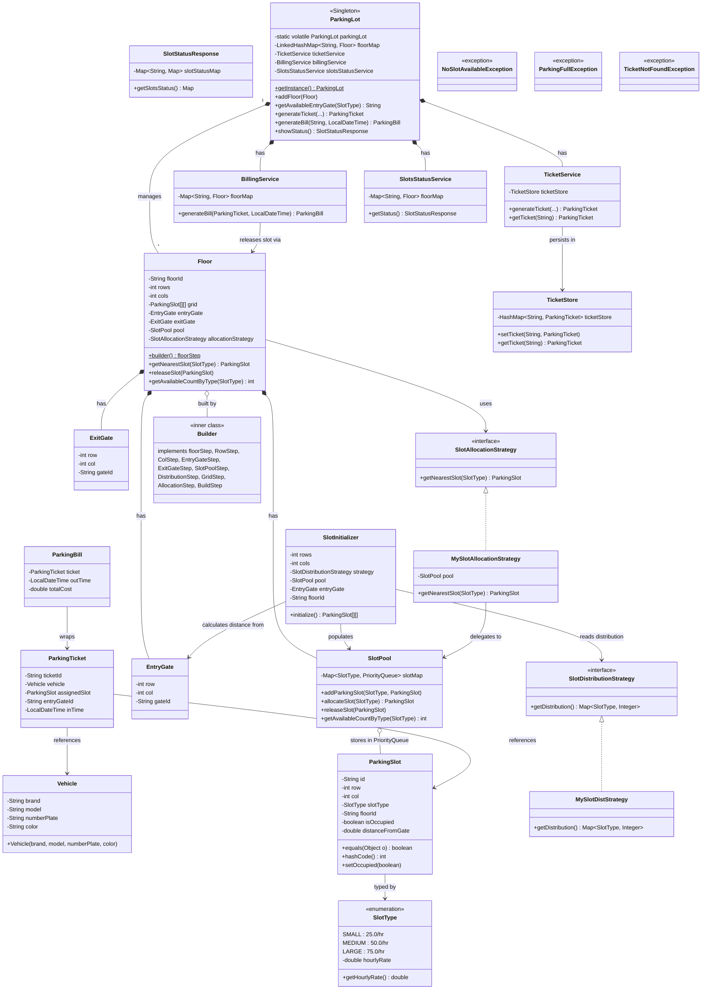
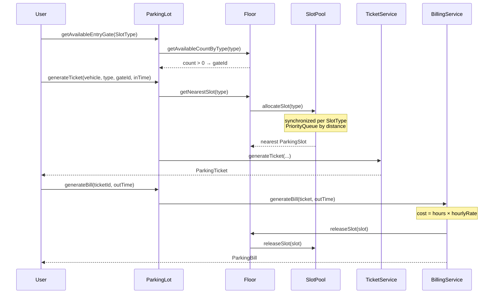

# Parking Lot System — Low Level Design

A production-grade parking lot management system implementing **Step Builder**, **Strategy**, **Singleton**, and **synchronized slot allocation** patterns.

## Architecture Overview

Multi-floor parking lot with distance-based slot allocation (priority queues), hourly billing, and thread-safe concurrent operations. Each floor has a grid of parking slots auto-initialized via a distribution strategy, with entry/exit gates positioned for Euclidean distance calculation.

## UML Class Diagram



## Design Patterns Used

| Pattern | Where | Purpose |
|---------|-------|---------|
| **Singleton** | `ParkingLot` | Single façade with double-check locking (`volatile` + `synchronized`) |
| **Step Builder** | `Floor.Builder` | Enforces correct build order via chained interfaces (11 steps) |
| **Strategy** | `SlotAllocationStrategy`, `SlotDistributionStrategy` | Swappable allocation logic and slot-type distribution ratios |
| **Façade** | `ParkingLot` | Orchestrates `TicketService`, `BillingService`, `SlotsStatusService` |

## Slot Allocation Flow



## Concurrency Design

- **`SlotPool.allocateSlot()`** — `synchronized` on per-type `PriorityQueue`, ensures no two threads get the same slot
- **`SlotPool.releaseSlot()`** — `synchronized` on the same queue, safely re-adds released slots
- **`ParkingLot`** — Singleton with `volatile` + DCL, thread-safe initialization

## Test Suite Structure — `ParkingLotTest.java`

The existing test file contains **13 test groups** covering all parameters:

| # | Test | What it validates |
|---|------|-------------------|
| 1 | **Singleton** | `getInstance()` returns same object |
| 2 | **Floor Setup & Status** | Multi-floor setup, correct slot counts per type |
| 3 | **Entry Gate Lookup** | Returns first available floor's gate |
| 4 | **Ticket Generation** | Vehicle details, slot assignment, type matching |
| 5 | **Nearest Slot** | Priority queue returns slot closest to entry gate |
| 6 | **Count Decrement** | Available count drops by 1 after allocation |
| 7 | **Bill Generation** | Cost = hours × rate, slot released back to pool |
| 8 | **ParkingFullException** | Thrown when all slots of a type are taken |
| 9 | **Floor Fallback** | Falls back to next floor when current floor is full |
| 10 | **Slot Reuse** | Released slot re-enters pool and is reassigned |
| 11 | **🔥 Concurrent — 40 threads** | 40 threads race for 40 SMALL slots, no duplicates |
| 12 | **🔥 Concurrent — Overflow** | 25 threads for 20 slots: 20 succeed, 5 throw `NoSlotAvailableException` |
| 13 | **🔥 Concurrent — Alloc+Release** | 20 release threads + 20 allocation threads run simultaneously |

### Running Tests

```bash
cd ~/LLD
javac designs/ParkingLot/*.java
java designs.ParkingLot.ParkingLotTest
```

## File Structure

```
designs/ParkingLot/
├── ParkingLot.java              # Singleton façade
├── Floor.java                   # Step Builder with 11 chained interfaces
├── ParkingSlot.java             # Grid-positioned slot with distance
├── SlotPool.java                # Synchronized PriorityQueue allocation
├── SlotInitializer.java         # Grid builder using distribution strategy
├── SlotType.java                # SMALL / MEDIUM / LARGE enum with rates
├── Vehicle.java                 # Immutable vehicle entity
├── ParkingTicket.java           # Ticket with vehicle + slot + time
├── ParkingBill.java             # Bill with cost calculation
├── EntryGate.java               # Gate position for distance calc
├── ExitGate.java                # Exit gate position
├── SlotAllocationStrategy.java  # Strategy interface
├── SlotDistributionStrategy.java# Distribution strategy interface
├── MySlotAllocationStrategy.java# Nearest-slot implementation
├── MySlotDistStrategy.java      # 40/40/20 distribution
├── TicketService.java           # Ticket generation + lookup
├── TicketStore.java             # In-memory ticket storage
├── BillingService.java          # Bill calculation + slot release
├── SlotsStatusService.java      # Floor-wise availability aggregation
├── SlotStatusResponse.java      # Status response DTO
├── NoSlotAvailableException.java
├── ParkingFullException.java
├── TicketNotFoundException.java
└── ParkingLotTest.java          # 13-test comprehensive suite
```
