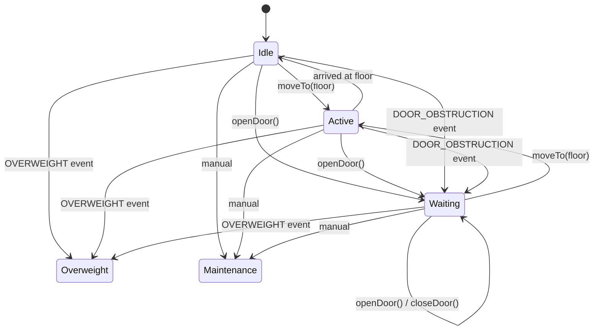

# Elevator System — Low Level Design

A comprehensive elevator management system implementing multiple design patterns: **State**, **Strategy**, **Singleton**, and **Observer**.

## Architecture Overview

The system models a real-world elevator scenario with multiple elevators managed by a central orchestrator, each with inner/outer panels, sensors, and state-driven behavior.

## UML Class Diagram

```mermaid
classDiagram
    direction TB

    %% ─── Enums ───
    class Direction {
        <<enumeration>>
        UP
        DOWN
        IDLE
    }

    %% ─── Core ───
    class Elevator {
        -int elevatorId
        -int currentFloor
        -ElevatorState state
        -InnerPanel innerPanel
        -Door door
        -WeightSensor weightSensor
        -DoorSensor doorSensor
        -Display display
        +Elevator(int elevatorId)
        +Elevator(int elevatorId, int totalFloors)
        +setState(ElevatorState state)
        +openDoors()
        +closeDoors()
        +moveTo(int floor)
        +handleSensorEvent(Event e)
        +publishStateChange()
    }

    class ElevatorOrchestrator {
        <<Singleton>>
        -static volatile ElevatorOrchestrator instance
        -List~Elevator~ elevators
        -AllocationStrategy strategy
        -ElevatorOrchestrator()
        +static getInstance() ElevatorOrchestrator
        +static resetInstance()
        +addElevator(Elevator elevator)
        +handleRequest(Floor floor, Direction direction)
        +onElevatorStateChange(Elevator e)
        +notifyDisplay(Elevator e)
        +setStrategy(AllocationStrategy strategy)
    }

    class ElevatorRequest {
        -int floorNo
        -Direction direction
        -long timeStamp
        +ElevatorRequest(int, Direction, long)
        +getFloorNo() int
        +getDirection() Direction
        +getTimeStamp() long
    }

    class Floor {
        -int floorId
        -OuterPanel outerPanel
        +Floor(int floorId)
        +getFloorId() int
        +getOuterPanel() OuterPanel
    }

    class Event {
        -String event
        +Event(String e)
        +getEvent() String
    }

    %% ─── State Pattern ───
    class ElevatorState {
        <<abstract>>
        #Elevator elevator
        +ElevatorState(Elevator elevator)
        +handleRequest()*
        +openDoor()*
        +closeDoor()*
        +moveTo(int floor)*
    }

    class IdleState {
        +handleRequest()
        +openDoor()
        +closeDoor()
        +moveTo(int floor)
    }

    class ActiveState {
        +handleRequest()
        +openDoor()
        +closeDoor()
        +moveTo(int floor)
    }

    class WaitingState {
        +handleRequest()
        +openDoor()
        +closeDoor()
        +moveTo(int floor)
    }

    class OverweightState {
        +handleRequest()
        +openDoor()
        +closeDoor()
        +moveTo(int floor)
    }

    class MaintenanceState {
        +handleRequest()
        +openDoor()
        +closeDoor()
        +moveTo(int floor)
    }

    ElevatorState <|-- IdleState
    ElevatorState <|-- ActiveState
    ElevatorState <|-- WaitingState
    ElevatorState <|-- OverweightState
    ElevatorState <|-- MaintenanceState

    %% ─── Strategy Pattern ───
    class AllocationStrategy {
        <<interface>>
        +allocate(List~Elevator~ elevators, ElevatorRequest req) Elevator
    }

    class NearestElevatorStrategy {
        +allocate(List~Elevator~ elevators, ElevatorRequest req) Elevator
    }

    AllocationStrategy <|.. NearestElevatorStrategy

    %% ─── Hardware ───
    class Door {
        -boolean isOpen
        +open()
        +close()
        +isOpen() boolean
    }

    class Display {
        -int id
        -int currentFloor
        -String currentState
        +Display(int displayId)
        +update(int floor, ElevatorState state)
    }

    class DoorSensor {
        -Elevator elevator
        -boolean isObstructed
        +setElevator(Elevator)
        +detectObstruction()
        +clearObstruction()
        +publish(Event e)
    }

    class WeightSensor {
        -Elevator elevator
        -float currentWeight
        -float maxCapacity
        +WeightSensor(float maxCapacity)
        +setElevator(Elevator)
        +onWeightChange(float weight)
        +publish(Event e)
    }

    %% ─── Buttons (Template Method) ───
    class Button {
        <<abstract>>
        -boolean isPressed
        -Elevator elevator
        +onPress()*
        +glow()
        +unglow()
        +setElevator(Elevator e)
        +getElevator() Elevator
    }

    class FloorButton {
        -int floorNo
        +FloorButton(int floorNo, Elevator elevator)
        +onPress()
        +getFloor() int
    }

    class OpenButton {
        +onPress()
    }

    class CloseButton {
        +onPress()
    }

    class AlarmButton {
        +onPress()
    }

    class DirectionalButton {
        -Floor floor
        -Direction direction
        +DirectionalButton()
        +DirectionalButton(Floor, Direction)
        +onPress()
    }

    Button <|-- FloorButton
    Button <|-- OpenButton
    Button <|-- CloseButton
    Button <|-- AlarmButton
    Button <|-- DirectionalButton

    %% ─── Panels ───
    class InnerPanel {
        -List~FloorButton~ floorButtons
        -OpenButton openButton
        -CloseButton closeButton
        -AlarmButton alarmButton
        +InnerPanel(List~FloorButton~ floorButtons)
        +bindToElevator(Elevator e)
        +getFloorButtons() List~FloorButton~
    }

    class OuterPanel {
        -DirectionalButton upButton
        -DirectionalButton downButton
        -Floor floor
        +OuterPanel(Floor floor)
        +pressUp()
        +pressDown()
    }

    %% ─── Relationships ───
    Elevator *-- Door : has
    Elevator *-- Display : has
    Elevator *-- InnerPanel : has
    Elevator *-- WeightSensor : has
    Elevator *-- DoorSensor : has
    Elevator --> ElevatorState : current state

    ElevatorOrchestrator "1" o-- "*" Elevator : manages
    ElevatorOrchestrator --> AllocationStrategy : uses
    ElevatorOrchestrator --> Display : notifies

    Floor *-- OuterPanel : has
    OuterPanel *-- DirectionalButton : has

    InnerPanel *-- FloorButton : has
    InnerPanel *-- OpenButton : has
    InnerPanel *-- CloseButton : has
    InnerPanel *-- AlarmButton : has

    DoorSensor --> Elevator : publishes to
    WeightSensor --> Elevator : publishes to
    DirectionalButton --> ElevatorOrchestrator : delegates to
    FloorButton --> Elevator : delegates to

    ElevatorOrchestrator ..> ElevatorRequest : creates
    ElevatorRequest --> Direction : uses
```



## Design Patterns Used

| Pattern | Where | Purpose |
|---------|-------|---------|
| **State** | `ElevatorState` + 5 states | Elevator behavior changes based on state (Idle, Active, Waiting, Overweight, Maintenance) |
| **Strategy** | `AllocationStrategy` | Swappable elevator allocation algorithm (e.g. `NearestElevatorStrategy`) |
| **Singleton** | `ElevatorOrchestrator` | Single point of coordination, thread-safe with double-check locking |
| **Observer** | Sensors → Elevator → Display | Sensors publish events to elevator; state changes notify display via orchestrator |

## State Transition Diagram



## Running Tests

```bash
cd /home/maverick/LLD
javac designs/elevator/*.java
java designs.elevator.ElevatorSystemTest
```

The test suite includes **17 test groups** with **50+ assertions** covering:
- Singleton thread-safety (50 concurrent threads)
- All state transitions
- Sensor events (overweight, door obstruction)
- Nearest-elevator strategy with exclusions
- End-to-end request flow
- Concurrent requests (20 threads)
- Concurrent elevator movement (8 threads)
- Runtime strategy swap
